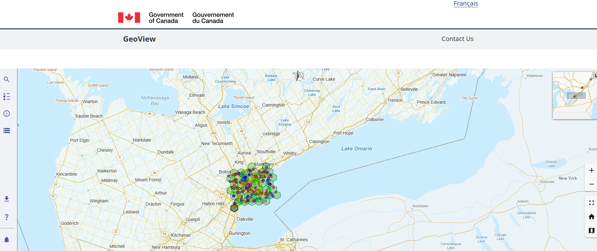

# GeoView App

Assesing the use NRCAN's geospatial tool for our use cases. (https://github.com/Canadian-Geospatial-Platform/geoview).

We've imbeded the map into a React App to maintain GoC look and feel. It can be viewed here: https://geoview-app-30926324358.northamerica-northeast1.run.app



Use the menus on the side and bottom to explore - adding and manipulating layers. The current map has polygons and points primarily in the Toronto and Ottawa areas and you will need to zoom in to see them more clearly. 

## To run locally: 

```
npm install 
npm run dev
```

## Run with docker: 

```
docker build -t geoview-app .
docker run --rm -p=8080:8080 geoview-app
```

## Add Data (programatically): 

[./public/data/](./public/data/)

If adding geojson data, we will need both the geojson data file as well as a corresponding metadata.meta file to outline styling and labels. (See [./public/data/sample-geojson.metadata.meta](./public/data/sample-geojson.metadata.meta) for examples). 

## Adjust the map configuration:

Change how the map, layers and menus render: 

[./public/config/sample-config.json](./public/config/sample-config.json)

Currently this also includes some samples from the GeoView GitHub repository.


## To Deploy: 

```
gcloud builds submit --config cloudbuild.yaml
```

## Helpful links: 

- https://github.com/Canadian-Geospatial-Platform/geoview/blob/a2d8d0e26198a8469b7c0dbb226d6964b40cbc57/docs/app/geoview-layer/map-config/README.md#L4
- https://github.com/cds-snc/gcds-components/blob/main/packages/vue/README.md

## Reponse to below
1a - layers can be loaded, but not styled client side (but can be with config files)
2 - max min can be configured in the codebase, but not in the UI
3 - clustering needs to be explored further


## From Zachary's notes

```
Symbology and Legend Support in GeoView
🔹 1. Symbology (Rendering of Data)
GeoView supports rendering geospatial layers with custom visual styles. This includes:

    a. Dynamic Styling Based on Layer Type
        WMS/WMTS layers can display server-defined symbology (from SLD or WMS GetLegendGraphic calls).
        >>>>>> 1 >>>>>Vector layers (e.g., GeoJSON, Esri Feature Layers) can be styled client-side using:
        Color (fill, stroke)
        Line thickness
        Point symbols (circles, custom icons, etc.)
        Opacity and dash patterns
        Scale-dependent visibility and zoom thresholds

    b. Thematic or Categorical Styling
        Attributes can drive symbology, e.g.:
        Population ranges → color gradient <----1
        Land use categories → unique fill styles <----1
        Classification methods: equal interval, quantile, manual breaks, etc. (if extended via configuration or API) <----1
    
    c. Custom Iconography
        Point features can use:
        SVG icons <-----1
        Image files
        Styled vector symbols <----1
        Supports rotating, scaling, or anchoring icons based on feature attributes <---1  

🔸 2. Legend Support (User Interface Element)
The legend feature provides a user-facing panel showing what each symbol on the map means.

a. Automatic Legend Generation
    For WMS/WMTS layers: via standard GetLegendGraphic calls
    For client-styled vector layers: a legend is generated based on the configuration or API-defined style rules

b. Legend Panel Features <--- 1 all of these
    Expand/collapse toggles for layer groups
    Hierarchical structure (groups and sublayers)
    Color swatches and icons shown alongside labels
    Updates dynamically when layers are toggled or changed

c. Multilingual Labeling
    Legend labels can support both English and French (via i18next or JSON config fields)

d. Interactivity
    Some configurations may support clickable legend entries (e.g., toggling visibility or zooming to a layer extent)
```

Asks: 
- bilingual interface (french/ envlish)
- high contrast UI modes (supported by themes) - specifically by symblogy support
- update polygon thematic styling  by: 

```
Yes, GeoView supports extensible UI components, and while it doesn’t currently ship with a full "on-the-fly styling widget" out of the box (like a GUI-based style editor similar to QGIS or ArcGIS Online), it does support the integration of custom widgets that could enable on-the-fly styling through the public API.

Here's what exists and what you can build:
✅ Existing Capabilities

🧩 1. Layer Panel + Configuration Toggling
    The Layer Panel widget allows users to toggle layers on/off and adjust visibility or opacity.
    Supports enabling/disabling layers with predefined styles.
    Some control over opacity sliders and layer ordering.

🧪 2. Developer Access to Styling via API
GeoView exposes a public API (cgpv.api) that allows programmatic updates to layer styles at runtime.
You can:
    Dynamically apply new symbology to vector layers.
    Re-render polygons with new color or stroke settings.
    Add input fields, dropdowns, or color pickers using custom UI and then call:
    Listen to UI widget events and push new styles without reloading the map.

tsCopyEditcgpv.api.setLayerStyle(layerId, styleObject);
``` 
```
What You Can Build (Custom Widget Ideas)
If you're customizing GeoView or contributing upstream, here are feasible widgets for on-the-fly styling:

🎨 A. Polygon Style Editor Widget
    Select a vector layer
    Choose field for classification (e.g., land_use)
    Choose classification method (unique values, graduated colors)
    Assign color ramps or individual swatches
    Apply immediately with setLayerStyle

🧮 B. Thematic Mapping Wizard
    Dropdown for attribute
    Choose classification (quantiles, equal interval, custom breaks)
    Color picker for each class
    Live preview on the map

⚙️ C. Opacity and Visibility Widget
    Slider for opacity per layer
    Checkbox to toggle outlines/strokes
    Option to switch base map and refresh legend accordingly

🗃️ D. Legend + Style Toggle Combo
    Clickable legend entries to:
    Show/hide certain styles or categories
    Re-color categories live
    Toggle visibility of thematic classes

🔧 Technical Enablers in GeoView
    Built with React — making UI customization modular and pluggable
    Uses Redux for state — useful for linking UI changes to map state
    Style updates via configuration-driven rendering and API — ideal for dynamic UI integrations

🗂️ Suggested Files/Folders to Explore for Custom Widgets
    In the geoview repo:
        /packages/geoview-core/src/ui/ – React components and widget shells
        /packages/geoview-core/src/api/ – API access to styling methods
        /packages/geoview-core/src/geo/layer/ – layer styling and management logic

🧩 Summary
Widget Feature	Built-in	Extendable	Via API
Layer visibility	✅	✅	✅
Opacity control	✅	✅	✅
On-the-fly color styling	❌	✅ (custom)	✅
Attribute-based theming	❌	✅ (custom)	✅
```